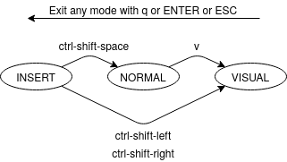
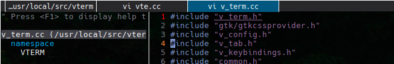

# VTerm
A terminal emulator that makes your life easier.

**Note:** We are still in beta version. Core features are pretty stable; more
features to come, code clean-up and documentation [todo.md](todo.md).

# Table of contents

- [VTerm](#vterm)
  - [Features](#features)
  - [Getting Started](#getting-started)
      - [Ubuntu \[20.04, 18.04\]](#ubuntu-2004-1804)
      - [Debian \[10\]](#debian-10)
      - [Fedora](#fedora)
      - [Arch](#arch)
  - [Building VTerm](#building-vterm)
    - [Dependencies](#dependencies)
    - [Building from source](#building-from-source)
  - [Shell Integration](#shell-integration)
  - [Commands and shortcuts](#commands-and-shortcuts)
  - [Configuration](#configuration)
  - [FAQ](#faq)
    - [Is VTerm VTE-based?](#faq1)
    - [Is VTerm a fork of Termite?](#faq2)
  - [Contributions](#contributions)

## Features
- **Highly customizable:** an easy to write configuration file with various
  options with sane defaults. \[[Jump to configuration section](#configuration)\]
- **Advanced Tabs support:**
    - Smart tabs shortcuts e.g. alternate tab, numbered tabs.
    - Configurable tab showing policy.
    - Configurable new tab placement.
    - Configurable new tab directory.
    - Tab bar styling.
- **VIM-like keyboard shortcuts:** yiw, yy, w, $, visual line and block modes
  and all the other good stuff, [see full list](#commands-and-shortcuts).
- **Prompt up/down:** ever got lost in a long command output trying to read the
  previous command? No more! Scroll to previous/next prompt directly.
- **Clickable links:** see a link or a `mailto`? Just click it!
- **Focus-aware background:** configurable background color and transparency
  based on terminal focus status so it is easy to identify currently focused
  terminal.
- **Bidirectional text support:** no more messed-up text that is written in
  right-to-left languages.
- **Well commented & structured code:** want to contribute? Feeling an urge to
  hack your own terminal? Take a look at the code! It was written with community
  contributions in-mind.
- **Lots more:** fullscreen, zoom-in/zoom-out, support for terminal images
  (i.e. using [Überzug](https://github.com/seebye/ueberzug)).

## Getting Started
#### Ubuntu \[20.04, 18.04\]
First install meson >= 0.50.0 [\[Install\]](https://mesonbuild.com/Quick-guide.html).

Then: 
```bash
(
# Install dependencies
sudo apt-get install -y cmake pkg-config libgtk-3-dev libpcre2-dev \
    libglib3.0-cil-dev libgnutls28-dev build-essential 

# clone VTerm
git clone --recursive https://github.com/man9ourah/vterm.git;
cd vterm;

# Ubuntu 20.04 have the new fribidi in apt
if [ "$(lsb_release -sr)" == "20.04" ]; then
    sudo apt-get install -y libfribidi-dev

    # Build & install VTerm without rpath set
    meson build && cd build && sudo ninja install;
else
    # Install fribidi
    git clone https://github.com/fribidi/fribidi .deps/fribidi;
    pushd .deps/fribidi;
        meson -Ddocs=false build;
        cd build;
        sudo ninja install;
    popd;

    # Build & install VTerm with rpath set
    meson -Dset_install_rpath=true build && cd build && sudo ninja install;
fi
)
```

For Ubuntu 16.04 and before, you will face issues with old dependencies
versions \[Please submit a PR if you have successfully installed VTerm in
Ubuntu 16.04 or older versions\].

#### Debian \[10\]
First install meson >= 0.50.0 [\[Install\]](https://mesonbuild.com/Quick-guide.html).

Then: 
```bash
(
# Install dependencies
sudo apt-get install -y cmake pkg-config libgtk-3-dev libpcre2-dev \
    valac gtk-doc-tools intltool libglib3.0-cil-dev libgnutls28-dev \
    libgirepository1.0-dev libxml2-utils gperf build-essential libsystemd-dev \
    libfribidi-dev;

# clone VTerm
git clone --recursive https://github.com/man9ourah/vterm.git;
cd vterm;

# Build & install VTerm
meson build && cd build && sudo ninja install;
)
```

#### Fedora
TODO: \[Please contribute if you installed on Fedora\]
#### Arch
TODO: \[Please contribute if you installed on Arch\] 

## Building VTerm
### Dependencies
- meson >= 0.50.0 [Install](https://mesonbuild.com/Quick-guide.html).
- ninja [Install](https://github.com/ninja-build/ninja/wiki/Pre-built-Ninja-packages).
- pkg-config [Install](https://www.freedesktop.org/wiki/Software/pkg-config/).
- cmake [Install](https://cmake.org/install/).
- GTK3 [Install](https://www.gtk.org/docs/installations/linux/).
- PCRE2 [Install](https://sourceforge.net/projects/pcre/).
- GNU Fribidi [Install](https://github.com/fribidi/fribidi) (Optional): Used for
  bidirectional language support. You can disable by adding
  `-Dvte-vterm:fribidi=false` to meson.
- GNUTLS [Install](https://www.gnutls.org/download.html) (Optional): Used to
  encrypt data written to the disk, i.e. terminal buffer. You can disable by
  adding `-Dvte-vterm:gnutls=false` to meson.
- Systemd [Install](https://www.freedesktop.org/wiki/Software/systemd/)
  (Optional): Disabled by default; used to spawn child shell processes into its
  own systemd scopes. You can enable by adding `-Dvte-vterm:_systemd=true` to meson.

**You think this list is incomplete?** Please make a PR or open an issue.

### Building from source
Having all dependencies met, you just need the following line for building and
installations:
```bash
meson build && cd build && sudo ninja install
```

This will build VTerm in `build/` and install only 4 files to your system: 
- `vterm` to `/usr/local/bin`. 
- `vte.sh` to `/usr/local/etc/profile.d/`.
- `vte-urlencode-cwd` to `/usr/local/libexec`.
- `vte-spawn-.scope.conf` to `/usr/local/lib/systemd/user/vte-spawn-.scope.d`.

You can change the prefix `/usr/local` using [meson options](https://mesonbuild.com/Builtin-options.html).

You can disable Fribidi, GNUTLS, and Systemd dependencies using meson options as
well. For example, to disable Fribidi the meson configure command will be:
```bash
meson -Dvte-vterm:fribidi=false build
```

## Shell Integration
The meson installation will install the file `vte.sh` to `/usr/local/profile.d/`
by default. This script needs to be sourced at the beginning of your shell
sessions for the integration to work. You can either move
`/usr/local/etc/profile.d/vte.sh` to `/etc/profile.d` if you are using a login shell
and your environment automatically source the files under that directory, or
simply add the following line somewhere in your `~/.zshrc` or `~/.bashrc` files:
```bash
source /usr/local/etc/profile.d/vte.sh

```

VTerm uses a shell integration script for mainly two things: 
- Marking command prompts lines for easier scrolling.
- Tracking current working directory for new tab opening.

You can simply ignore the shell integration without affecting your terminal 
behavior, but you will miss out on those two features.

## Commands and shortcuts
VTerm have three modes:
- **Insert mode**. The default mode.
- **Normal mode**. User input is not forwarded to child application, and most
  commands work here. This is like Normal mode in VIM, and Copy mode in tmux.
- **Visual modes**. Three visual modes available. Enables you to select
  characters, blocks, or lines.

<p align="center">
    
</p>

#### General Shortcuts
Keyboard shortcuts that works in all modes:

<table align="center">
    <tbody>
        <tr>
            <td>Key</td>
            <td>Function</td>
        </tr>
        <tr>
            <td colspan=2>Tabs</td>
        </tr>
        <tr>
            <td><code>ctrl-shift-t</code></td>
            <td>Opens a new tab</td>
        </tr>
        <tr>
            <td><code>ctrl-shift-l</code></td>
            <td rowspan=2>Switch to the next tab</td>
        </tr>
        <tr>
            <td><code>ctrl-pageDown</code></td>
        </tr>
        <tr>
            <td><code>ctrl-shift-h</code></td>
            <td rowspan=2>Switch to the previous tab</td>
        </tr>
        <tr>
            <td><code>ctrl-pageUp</code></td>
        </tr>
        <tr>
            <td><code>ctrl-shift-^</code></td>
            <td>Switch to the last tab (alternate tab)</td>
        </tr>
        <tr>
            <td><code>ctrl-shift-1</code></td>
            <td>Swtich to the first tab (quick access)</td>
        </tr>
        <tr>
            <td><code>ctrl-shift-2</code></td>
            <td>Switch to the second tab (quick access)</td>
        </tr>
        <tr>
            <td><code>ctrl-shift-3</code></td>
            <td>Switch to the third tab (quick access)</td>
        </tr>
        <tr>
            <td><code>ctrl-shift-w</code></td>
            <td>Close current tab</td>
        </tr>
        <tr>
            <td><code>ctrl-shift-k</code></td>
            <td rowspan=2>Move tab to the right</td>
        </tr>
        <tr>
            <td><code>ctrl-shift-pageDown</code></td>
        </tr>
        <tr>
            <td><code>ctrl-shift-j</code></td>
            <td rowspan=2>Move tab to the left</td>
        </tr>
        <tr>
            <td><code>ctrl-shift-pageUp</code></td>
        </tr>
        <tr>
            <td colspan=2>Copy and search</td>
        </tr>
        <tr>
            <td><code>ctrl-shift-c</code></td>
            <td>Copy selected text</td>
        </tr>
        <tr>
            <td><code>ctrl-shift-v</code></td>
            <td>Paste text</td>
        </tr>
        <tr>
            <td><code>ctrl-shift-?</code></td>
            <td>Search up</td>
        </tr>
        <tr>
            <td><code>ctrl-shift-/</code></td>
            <td>Search down</td>
        </tr>
        <tr>
            <td><code>ctrl-shift-n</code></td>
            <td>Next search result</td>
        </tr>
        <tr>
            <td colspan=2>Navigation</td>
        </tr>
        <tr>
            <td><code>ctrl-shift-o</code></td>
            <td>Scroll one prompt up</td>
        </tr>
        <tr>
            <td><code>ctrl-shift-i</code></td>
            <td>Scroll one prompt down</td>
        </tr>
        <tr>
            <td><code>shift-pageUp</code></td>
            <td>Scroll one page up</td>
        </tr>
        <tr>
            <td><code>shift-pageDown</code></td>
            <td>Scroll one page down</td>
        </tr>
        <tr>
            <td colspan=2>Mode switching</td>
        </tr>
        <tr>
            <td><code>ctrl-shift-space</code></td>
            <td>Switch to normal mode</td>
        </tr>
        <tr>
            <td><code>ctrl-shift-Left</code></td>
            <td>Switch to visual mode and select one char left</td>
        </tr>
        <tr>
            <td><code>ctrl-shift-Right</code></td>
            <td>Switch to visual mode and select one char right</td>
        </tr>
        <tr>
            <td colspan=2>Zoom</td>
        </tr>
        <tr>
            <td><code>ctrl-shift-+</code></td>
            <td>Zoom-in</td>
        </tr>
        <tr>
            <td><code>ctrl--</code></td>
            <td>Zoom-out</td>
        </tr>
        <tr>
            <td><code>ctrl-=</code></td>
            <td>Scale font size back to 1</td>
        </tr>
        <tr>
            <td><code>F11</code></td>
            <td>Full screen </td>
        </tr>
    </tbody>
</table>

#### Normal & Visual Modes Commands
Commands for normal and visual modes. This in addition to arrows
and `hjkl` movements.

<table align="center">
    <tbody>
        <tr>
            <td>Key</td>
            <td>Function</td>
        </tr>
        <tr>
            <td colspan=2>Mode switching</td>
        </tr>
        <tr>
            <td><code>v</code></td>
            <td>Visual mode</td>
        </tr>
        <tr>
            <td><code>V</code></td>
            <td>Visual line mode</td>
        </tr>
        <tr>
            <td><code>ctrl-v</code></td>
            <td>Visual block mode</td>
        </tr>
        <tr>
            <td><code>Enter</code></td>
            <td rowspan=3>Exit one mode backword</td>
        </tr>
        <tr>
            <td><code>q</code></td>
        </tr>
        <tr>
            <td><code>Esc</code></td>
        </tr>
        <tr>
            <td colspan=2>Navigation</td>
        </tr>
        <tr>
            <td><code>H</code></td>
            <td>Go to top of screen</td>
        </tr>
        <tr>
            <td><code>L</code></td>
            <td>Go to bottom of screen</td>
        </tr>
        <tr>
            <td><code>M</code></td>
            <td>Go to middle of screen</td>
        </tr>
        <tr>
            <td><code>w</code></td>
            <td rowspan=2>Move one word to the right</td>
        </tr>
        <tr>
            <td><code>ctrl-Right</code></td>
        </tr>
        <tr>
            <td><code>b</code></td>
            <td rowspan=2>Move one word to the left</td>
        </tr>
        <tr>
            <td><code>ctrl-Left</code></td>
        </tr>
        <tr>
            <td><code>W</code></td>
            <td rowspan=2>Move one statement to the right</td>
        </tr>
        <tr>
            <td><code>shift-Right</code></td>
        </tr>
        <tr>
            <td><code>B</code></td>
            <td rowspan=2>Move one statement to the left</td>
        </tr>
        <tr>
            <td><code>shift-Left</code></td>
        </tr>
        <tr>
            <td><code>e</code></td>
            <td>Move to the end of current word</td>
        </tr>
        <tr>
            <td><code>E</code></td>
            <td>Move to the end of current statement</td>
        </tr>
        <tr>
            <td><code>Home</code></td>
            <td rowspan=2>Go to beginning of line</td>
        </tr>
        <tr>
            <td><code>0</code></td>
        </tr>
        <tr>
            <td><code>End</code></td>
            <td rowspan=2>Go to end of line</td>
        </tr>
        <tr>
            <td><code>$</code></td>
        </tr>
        <tr>
            <td colspan=2>Yanking</td>
        </tr>
        <tr>
            <td><code>yy</code></td>
            <td>Copy current line</td>
        </tr>
        <tr>
            <td><code>yw</code></td>
            <td>Copy from this char to end of word</td>
        </tr>
        <tr>
            <td><code>yiw</code></td>
            <td>Copy this whole word</td>
        </tr>
        <tr>
            <td><code>yW</code></td>
            <td>Copy from this char to end of statement</td>
        </tr>
        <tr>
            <td><code>yiW</code></td>
            <td>Copy this whole statement</td>
        </tr>
        <tr>
            <td colspan=2>Search</td>
        </tr>
        <tr>
            <td><code>?</code></td>
            <td>Search up</td>
        </tr>
        <tr>
            <td><code>/</code></td>
            <td>Search down</td>
        </tr>
        <tr>
            <td><code>n</code></td>
            <td>Next search result</td>
        </tr>
        <tr>
            <td><code>N</code></td>
            <td>Previous search result</td>
        </tr>
    </tbody>
</table>

VTerm was built so that it is easy to add more commands & shortcuts. If you have
an idea for a new command, please let us know.

## Configuration
VTerm is very configurable. The [default configuration file](default_vterm.conf)
contains all possible configuration options as well as their default values. 
We suggest copying the [default config file](default_vterm.conf) to 
`~/.config/vterm/vterm.conf` and edit it there. Simply reopen VTerm to update
the configuration options.

#### Tab bar Styling
VTerm wants you to be able to customize everything! Although this feature is not
user friendly (yet), you can customize the tab bar style using a CSS file that
will be applied to the tab bar GTK object. To give an example, see
[notebook_style.css](notebook_style.css). The result of which is: 

<p align="center">
    
</p>

## FAQ
- <a id="faq1">**Is VTerm [VTE-based](https://github.com/GNOME/vte)?**</a>

Yes, but not the upstream vte. VTerm uses its
[own version of vte](https://github.com/man9ourah/vte-vterm/tree/vterm) to add
support for lots of features like the command prompt marking and the normal &
visual modes cursors. However, unlike most (all?) other vte based terminals,
VTerm is **statically linked** to its own version of libvte; so it is not a
runtime requirement. This makes it much easier to install in systems where other
vte-based terminals exists.

- <a id="faq2">**Is VTerm a fork of [Termite](https://github.com/thestinger/termite)?**</a>

Termite is great! But no, VTerm is not a fork of Termite. VTerm definitely was
inspired by it, but the two do things in totally different manners.
1. Unlike Termite, VTerm's version of libvte is much more integrated into the
   new features of VTerm. Termite's version of libvte is only exposing inner
   states functions, which is limiting at best.
2. Unlike Termite, VTerm is statically linked to libvte.
3. Unlike Termite, VTerm provides much more customizability.
4. Unlike Termite, VTerm provides tab support.
5. Unlike Termite, VTerm is written with community contributions in mind.

## Contributions
**ALL** Contributions are welcomed! However, to better coordinate the efforts,
please take a look at the [todo.md](./todo.md) file and let us know by opening
an issue. If you are reporting a bug, please open an issue. 

#### Author
Mansour Alharthi \[[Email](mailto:man9our.ah@gmail.com)\]\[[Twitter](https://twitter.com/Man9ourah)\].
